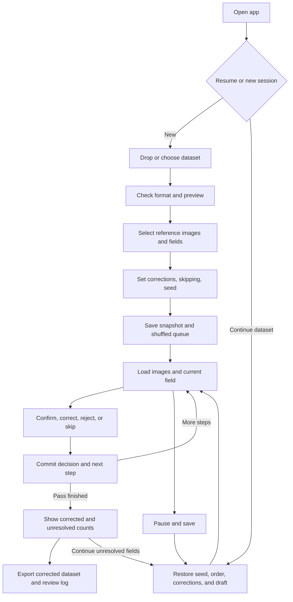

# DynaVal implementation pipeline

Status: the local application and its import, review, persistence, media, export,
synthetic-test and packaging implementations are present. This document remains
the workflow and version-1 data contract, including release acceptance criteria.
The final macOS arm64 executable passed local startup and workflow checks.
Verification is recorded separately below; Windows native verification requires
a Windows runner. GitHub Actions, signing and publication belong to the maintainer.

## 1. Product contract and decisions

DynaVal helps one person produce a corrected dataset by comparing selected fields
with source images, accepting good values, and fixing incorrect ones. It runs
locally as a NiceGUI native desktop window. A session fixes the input, reference
columns, selected fields, settings, and review order, then saves corrections and
review decisions. Transcription-accuracy reporting is an optional secondary use
of those records. The application remains configurable across datasets/domains.

Confirmed scope:

| Decision | Implementation |
| --- | --- |
| Initial distribution | Both macOS and Windows; Linux deferred |
| Build automation | GitHub Actions builds/tests macOS arm64 and Windows x64, prepares draft releases on matching version tags, and supports manual build-only runs |
| Dataset coverage | All rows in reproducible shuffled order; no random subset or train/test split |
| Reference material | One or more columns containing HTTP(S) image URLs, local paths, or mounted-share paths |
| Corrections | Enabled by default; configurable for each session |
| Skipping | Configurable for each session; default off |
| Validity meaning | `valid` describes the original field; `status` explains the final review outcome |
| Primary output | A corrected dataset CSV preserving original row/column order and applying accepted replacements |
| Supporting outputs | A separate CSV review log with one row per scheduled field; optional transcription-accuracy summary |
| Persistence | Local SQLite plus an immutable source-file snapshot and image cache |
| Continue unfinished work | Restore the same seed, saved order, selected fields, corrections, active pass, draft, and current step |
| Initial runtime | Python 3.13, NiceGUI native mode, pywebview, uv, PyInstaller |

The validity interpretation follows the user's intent. A correction does not
retroactively make the original value valid. `status=corrected` and the replacement
`effective_value` make the accepted replacement explicit.

Implementation defaults chosen here: fields stay grouped by source row, selected
columns use source order, skips defer a field without a verdict, and all selected
reference images must load before a validity/correction decision. Explicit follow-up
passes revisit unresolved fields without changing the seed or original order. These defaults
are part of v1 and can be revised through an explicit product change.

Exclude from v1: accounts, concurrent reviewers, cloud synchronization, automatic
validation/OCR, overwriting the original source file, sampling, reviewer assignment, arbitrary
format plugins, authenticated image-provider integrations, and automatic updates.
CSV/TSV, JSONL/NDJSON, and JSON arrays cover the initial format adapters; Excel and
Parquet can be added through the same importer interface later.

## 2. What the reference dataset requires

Local inspection of `measles_data_27_08.csv` found:

- 805,566 bytes, 1,115 data records, and 43 columns when parsed using `$`.
- All records have the expected column count with that delimiter.
- `first_file_path`, `second_file_path`, and `third_file_path` each contain Windows
  UNC `.jpg` paths, not HTTP URLs.
- Literal dotted headers such as `fp.patient.age.number`, text with non-ASCII
  characters, literal `NA`, and inconsistent apparent types across fields.

Therefore, delimiter selection, text preservation, multiple images, and mapping
UNC prefixes to mounted directories are required. Do not infer field types or
image mappings from names such as `fp.*` and `tp.*`. The user selects the mapping.
The reference file remains ignored and is never bundled or used as a CI fixture.
Image availability has not been tested against the private share.

### 2.1 Motivating request and general-purpose behavior

The colleague's priority is an accurate patient registry: show the source image
and extracted value, accept it when correct, otherwise replace it. The reviewer
must choose a manageable set of fields suited to their knowledge, for example
dates versus fields requiring Danish reading. Accuracy reporting helps evaluate
the extraction process but must not dominate the correction workflow.

Example selections from the reference schema are listed below as setup guidance,
not application defaults or a hardcoded medical schema:

| Requested information | Example selectable columns |
| --- | --- |
| Top diagnosis | `fp.diagnoses.top.conditions` |
| Bottom diagnosis | `fp.diagnoses.bottom.diagnosis` |
| Name | `fp.patient.name` |
| Address | `fp.patient.address.street`, `fp.patient.address.number`, `fp.patient.address.apt` |
| Age | `fp.patient.age.number`, `fp.patient.age.unit`, `fp.patient.age.note` |
| Household position | `fp.patient.household_position` |
| Admission | `fp.hospital_stay.admission_date` |
| Discharge | `fp.hospital_stay.release_date` |
| Stay length | `fp.hospital_stay.stay_length` |
| Nutrition | `tp.nutrition` |
| Exanthem | `tp.exanthem` |

Nutrition and exanthem can require interpreting the journal, not copying a literal
word. Let reviewers enter their informed correction; do not infer classifications
or impose a medical vocabulary from this email. Domain-specific instructions or
future presets must remain configurable. Other datasets use the same import,
field-selection, source-image, correction, continuation, and export flow.

## 3. User journey

The implemented interface uses a quiet, light desktop layout with short action
labels, visible source/value comparison, and explicit edited/save/error states.
The design palette is Ruby Red `#a31621`, Coral Glow `#f78764`, Azure Mist `#f2fdff`,
Pearl Aqua `#9ad4d6`, and Prussian Blue `#101935`. Theme colors and shared styles
live in `ui/theme.py` and `ui/styles.css`. Preserve readable contrast, clear focus
and restrained text; the correction workflow takes priority over accuracy scores.



### 3.1 Open or import

1. Show New Validation and Continue Dataset, with saved dataset names, selected
   fields, last update, resolved/total counts, and remaining work. An interrupted
   active session is offered for recovery.
2. Accept one file through drag-and-drop or the native file picker. Use the same
   import service for both. Initial upload limit: 100 MiB, configurable in code.
3. Stage a copy locally while calculating SHA-256. Never modify the user's file.
   If the hash matches existing sessions, offer to continue the selected session
   or explicitly start a new one. A matching filename alone is not sufficient;
   never silently merge sessions or reset prior work.
4. Detect format from the extension plus parse validation. Show format, encoding,
   delimiter, headers, row count, and a small preview before continuing.
5. CSV defaults to UTF-8 with optional BOM. Suggest delimiters from comma, tab,
   semicolon, pipe, and `$`, with a single-character override. Auto-detection is
   advisory: ambiguous files require a choice in the preview. TSV defaults to tab.
   Offer an encoding override after a decoding error; never silently replace bytes.
6. Stream CSV records with the standard-library parser and retain exact cell
   strings. Support quoted delimiters, quotes, and newlines. Reject blank/duplicate
   headers and inconsistent record widths with record/line diagnostics. Do not
   silently skip malformed records. Blank physical lines outside quoted records
   are ignored; an explicitly empty cell remains an empty string.
7. JSONL/NDJSON requires one object per nonblank line; JSON requires an array of
   objects. Reject duplicate object keys, non-finite numbers, invalid JSON, and
   non-object records. Build a top-level column union in first-seen order.
   Dotted keys stay literal; nested arrays/objects are single values displayed as
   compact JSON, rather than implicitly flattened. Distinguish missing keys, JSON
   null, empty strings, and literal text. Retain value kinds alongside display text.
8. Use exact integer parsing and decimal parsing for JSON numbers; centralize the
   canonical display serializer so precision is not lost to binary floats. String
   values display without JSON quotes; other values use their canonical JSON text.
   This serializer is for review/export, not rewriting the source file.
9. Reject empty datasets or schemas. Import runs off the UI loop with progress and
   cancellation. Incomplete imports cannot appear as resumable sessions.

All adapters produce `DatasetSchema` and records with stable zero-based
`source_row`, original column positions, cell text, and value kind. Source-row
identity follows parsed record order, excluding headers and ignored blank lines;
it does not depend on a potentially duplicated ID column.

### 3.2 Connect ground truth and choose fields

1. Select at least one image-reference column. Suggest path/URL-looking columns
   but require explicit selection. Show a preview for a chosen row and label each
   image by its source column. Preserve all selected images in source-column order.
2. Support HTTP(S), absolute local paths, relative paths, and mounted share paths.
   Resolve relative paths against a saved reference base directory, initially the
   original dataset directory when known. An upload without that directory asks
   for a base directory if relative references occur.
3. On Windows, open native drive paths and UNC shares through the user's existing
   filesystem access. For Windows UNC paths on macOS, allow a prefix mapping, for example
   `\\server\share\images` to `/Volumes/images`. Parse Windows path components
   with Windows path semantics, then join the suffix onto the local root. Match
   prefixes at component boundaries, using the longest matching prefix. Reject
   traversal outside the mapped root. Never rewrite the original dataset paths.
   Share mounting and authentication remain the operating system's responsibility.
4. Select one or more validation columns from a searchable list with value
   previews and select-all/clear controls. Reference columns are excluded from
   the review selection in v1. Preserve selection in source-column order.
5. Show the workload before start: `row_count × selected_column_count` steps.
   All 40 non-image fields in the reference would produce 44,600 steps.

Changing the imported file, parser settings, reference-column selection, selected
fields, or review settings after start creates a new session. Repairing an image
base directory or mounted-prefix mapping is allowed in a paused session, recorded
with a timestamp, and invalidates affected cache mappings without altering results.

### 3.3 Configure and start

Expose Corrections (on), Allow skipping (off), and an advanced numeric random seed.
Generate a 64-bit nonnegative seed when none is supplied; validate supplied seeds
against the same range. Explain that randomization changes row order only.

At Start, finish structural validation and atomically publish the session:

1. Assign a UUID session ID and preserve the staged source bytes and SHA-256.
2. Persist parser options, normalized rows/schema, image settings, selected column
   indexes, correction/skip settings, seed, app version, Python version, and
   persistence/queue algorithm versions.
3. Shuffle `range(row_count)` with a dedicated `random.Random(seed)` instance.
4. Expand each shuffled row into its selected columns in source order. Persist
   every `(step_index, source_row, src_col)` pair as the authoritative queue.
5. Set the cursor to the first step and the session to active. Start review only
   after the snapshot, database transaction, and session publication succeed.

The saved queue guarantees identical resume behavior even if a future runtime
changes random behavior. The seed provides reproducibility for a new run using
the same input, settings, and queue algorithm/runtime version.

### 3.4 Review one field

Use a resizable two-pane layout: reference-image viewer on the left, field review
on the right. Keep the current field name, original value, progress, and actions
visible. Show `Step n of N`, source record number, and separate outcome counts.
On follow-up passes, show pass progress separately from overall resolved/total
fields; the original step ID remains unchanged.
Display source record numbers as one-based in the UI, while exports use zero-based
indexes. Show missing/null/empty values explicitly without changing their data.

The image viewer supports labeled image tabs, zoom, pan, fit/reset, and loading or
error feedback. Preserve viewer state while reviewing fields from the same row;
reset it when changing rows. Initially support JPEG, PNG, and WebP. Decode and
normalize display orientation with Pillow; keep the source image cache unchanged.

Load reference bytes in the media service, using async HTTPX for URLs and workers
for files/decoding. Cache successful loads per session and record content hashes.
Use a 20 MiB/image download limit, a 50-megapixel decode limit, a 30-second overall
load timeout, and at most two retries for transient network errors. Bound redirects
to three HTTP(S) hops; do not fetch arbitrary URL schemes. Load the current row
first and prefetch at most one next row. These limits are centralized settings.
The implemented cache has a 256 MiB per-session target; pinned current/next-row
images can temporarily exceed that target. Successful cached images support
offline review; uncached remote images require their network source.

Only serve registered session images through local opaque media IDs. Dataset text
is escaped text, never HTML. Do not expose unrestricted filesystem-serving routes.
Requests must be associated with the expected row so a late image response cannot
replace a newer row's reference. Store remote reference hashes used by decisions;
if an evicted reference later changes, report it before review continues.

Every configured reference for the current row must load before Confirm, Save
Correction, or Mark Invalid is enabled. A missing/blank/unreadable reference offers
retry, pause to repair paths, and Skip if permitted. A media failure is never an
automatic rejection. Cached images can be reviewed offline; uncached remote
images require their network source.

| Action | Stored result | UI behavior |
| --- | --- | --- |
| Confirm as Valid | `status=confirmed`, `valid=true`, no correction | Accept unchanged original and advance after save |
| Save Correction | `status=corrected`, `valid=false`, replacement text | Visible original/replacement comparison; advance after save |
| Mark Invalid | `status=rejected`, `valid=false`, no correction | Reject without needing to supply a correction |
| Skip | `status=skipped`, `valid=null`, no correction | Enabled only if skipping is allowed; advance after save |
| Pause Validation | No new verdict | Save draft/cursor, mark paused, return to sessions |

Corrections use a text editor. The original stays visible and immutable. Compare
text exactly, including whitespace, to determine the Edited badge; reverting to
the original clears it. Show a pending Edited badge before submission and a saved
Corrected outcome afterward. Disable Confirm while an edited draft exists; make
the user save the correction or revert. An unchanged draft cannot be submitted
as a correction. An explicit empty-string replacement is valid and is shown as
“empty string.” For a missing/null original, require explicit edit activation to
distinguish an intended empty replacement from an untouched blank editor.

Disable Reject/Skip while a correction draft is active until it is saved or
reverted, so another action cannot silently discard an edit. A saved correction
is accepted replacement text; v1 does not enforce a guessed source datatype.
No automatic trimming, normalization, or conversion occurs on submission.

Disable actions while saving. Enforce the same constraints in the session service
using the expected session/step ID and a unique decision key. Commit decision,
reference hashes, timestamp, draft deletion, and cursor update together. Only then
advance the screen. A failed commit leaves the current step and draft intact.

Skip ends the current visit without resolving the field. A rejection records that
the original is wrong but still needs a replacement. Keep Confirm and Save
Correction as the primary actions; Mark Invalid is a secondary action for cases
where the reviewer knows the value is wrong but cannot supply the correction.
The summary offers Continue unresolved fields in saved queue order. No automatic
revisit loop or general decision-history editor is needed in v1.

### 3.5 Pause, close, and continue an unfinished dataset

Continuing is a normal part of the correction workflow, including after restarting
the application days later. Continue Dataset restores the original seed AND the
persisted queue, selected columns, settings, committed corrections, active pass,
cursor, and draft. The reviewer does not reconfigure or start from the beginning.
The seed alone cannot reconstruct which fields were corrected or left unfinished.

Every confirmed decision is durable immediately; Pause is not the only save point.
Autosave in-progress correction drafts after a short debounce (500 ms) and visibly
indicate saving/saved/error. Pause waits for any in-flight decision, flushes the
current draft, and commits `state=paused` before reporting success.

Window-close hooks attempt the same flush and pause, but correctness never relies
on a close event. On recovery, an active session is treated as interrupted. All
committed decisions survive; typing after the last draft autosave may not survive
an abrupt process kill. Do not promise recovery of unsaved keystrokes.

Resume validates schema-version support and the source snapshot hash, loads the
persisted queue, active pass, and decisions, derives the first step not submitted
in that pass, checks the saved cursor, and restores the current draft. It never reimports a changed external file
or reshuffles. A moved original dataset does not prevent resume from the snapshot;
image paths can still need repair. Corrupt snapshots, unsupported future schemas,
or inconsistent queue/decision records produce a recoverable error rather than
silently starting over. Back up sessions before applying a schema migration.

For an explicit unresolved follow-up pass, take only steps whose latest status is
`rejected` or `skipped`, in their ORIGINAL saved `step_index` order. Store a new
pass ID and its ordered step references, not a new random queue. Each submission
updates that step's latest decision and appends the previous/current transition
to history in the same transaction. Preserve the original value and original
seed. Use `(pass_id, step_index)` for submission idempotency; a pause midway through
this pass resumes at its first unsubmitted step, even if an earlier step is skipped
again. Review-log exports still contain exactly one latest row per original step.

Pending first-pass work is continued before offering a follow-up pass. A field
remains unresolved until confirmed or corrected. If corrections were disabled,
the session can document outstanding errors but cannot claim correction completion;
the reviewer must start a correction-enabled session to supply replacements.
Exported CSVs are deliverables, not checkpoints: continuing uses the saved session,
not a reimported corrected CSV, which would establish a different original baseline.

### 3.6 Finish and export

At the end of a pass, show accepted originals, corrected values, and unresolved
fields. Set `state=completed` only when every selected field is `confirmed` or
`corrected`; otherwise use `state=needs_attention` and offer Continue unresolved
fields. Pause during any pass stores `state=paused`. Label completion as
“Selected fields corrected/reviewed,” not a claim of 100% dataset accuracy or
review of unselected columns. A human-approved dataset is the goal, not a
percentage score on the main review screen.

Offer Export Corrected Dataset as the primary action. It produces a new CSV with
the original rows/columns and committed replacements, plus a separate review log
that identifies unreviewed or unresolved selected fields. Export Progress remains
available on paused/needs-attention sessions using the same contracts, clearly
marked partial in the export summary and manifest. Optional accuracy reporting
does not block correction or export. A canceled/failed export preserves the saved
session and every committed correction for retry.

The review log contains every scheduled step in saved queue order; undecided
steps have `status=pending` and blank verdict/timestamp/correction. Unsaved drafts
are never exported as decisions or applied to the corrected dataset. No review-log
rows are created for unselected columns; those columns DO remain in the dataset.

Write comma-delimited UTF-8 CSV with a BOM and standard CSV quoting using `csv`.
Booleans are lowercase `true`/`false`; a missing verdict is an empty CSV cell.
Choose an export parent directory and create a uniquely named export folder.
Write the dataset, log, and manifest into a temporary sibling folder from one
consistent database snapshot, flush/close the files, then publish with a folder
rename. A name collision uses a new unique suffix; never overwrite the source or
any existing output. Do not report success before the entire bundle is published.
Record successful export location/time separately so failure cannot lose reviews.

CSV is a data export: preserve literal text, including leading zeros and strings
beginning with spreadsheet formula characters. Document importing value columns
as text in spreadsheet software rather than silently mutating the exported data.

## 4. Export contracts, version 1

### 4.1 Corrected dataset: primary deliverable

`corrected_dataset.csv` contains exactly the imported record count, all original
columns in original schema order, and records in original source order, regardless
of shuffled review order. Do not insert audit columns into the source schema.

For each source coordinate, use the committed correction if its latest outcome
is `corrected`; otherwise preserve the original value. In particular, keep image
references, unselected values, and pending/skipped/rejected values unchanged.
Never delete incomplete rows, substitute blank for a rejected value, or apply a
draft. An intentional empty-string correction DOES replace the original text.

CSV/TSV inputs retain their cell text exactly; the output uses the common CSV
encoding/delimiter specified above. For JSON inputs, export the top-level schema
union and canonical cell text. Missing keys and JSON null become empty CSV cells;
literal strings remain literal. Since CSV cannot preserve these JSON distinctions
alone, `manifest.json` includes a sparse list of original `null`/`missing` cell
coordinates/kinds across all columns, including unselected ones. Exclude cells
replaced by corrections from that list. The saved source snapshot remains the
lossless JSON original; this deliverable is a tabular CSV, not a JSON rewrite.

Each published export folder contains `corrected_dataset.csv`, `review_log.csv`,
and `manifest.json`. The manifest records contract version, session ID, source hash,
export time, seed, selected/reference columns, parser options, original schema,
record count, output filenames, and pending/skipped/rejected/confirmed/corrected
counts. Its `selected_fields_complete` flag is true only when all selected steps
are resolved. `all_fields_selected` separately indicates whether every eligible
non-reference column was selected. Neither flag guarantees factual accuracy.

Acceptance example: a two-row dataset `image_url,name,age` reviewed in reverse row
order with only `age` selected still exports two rows in original order with all
three columns. Correcting source row 0 from `12` to `13` changes exactly that cell;
leaving source row 1 unfinished preserves its age and creates a `pending` log row.

### 4.2 Review log: one row per selected field

`valid` is nullable because skipped/pending fields have no judgment. A string
column alone cannot distinguish no correction from an empty-string correction;
`status` and `is_corrected` resolve that ambiguity.

| Column | Type / meaning |
| --- | --- |
| `schema_version` | Integer export-contract version, initially 1 |
| `session_id` | UUID tying all output rows to a saved session |
| `dataset_sha256` | Hash of the exact imported file bytes |
| `step_index` | Zero-based position in the saved review queue |
| `source_row` | Zero-based original data-record index |
| `src_col` | Zero-based index in the complete source schema |
| `src_col_name` | Exact column header/key |
| `original_value` | Original CSV text or canonical JSON display text |
| `original_kind` | `string`, `number`, `boolean`, `null`, `missing`, `object`, or `array` |
| `status` | `confirmed`, `corrected`, `rejected`, `skipped`, or `pending` |
| `valid` | `true` only for confirmed originals; `false` for corrected/rejected; otherwise blank |
| `is_corrected` | Boolean; true exactly when status is corrected |
| `correction` | Accepted replacement text; blank for other outcomes and for an empty replacement |
| `effective_value` | Correction for corrected fields; original display text otherwise |
| `effective_kind` | `string` for corrections; original kind otherwise |
| `reference_sources` | JSON array of selected image-column indexes, names, and original references |
| `reference_sha256` | JSON array of matching content hashes; null entries for unavailable/unloaded images |
| `reviewed_at` | UTC ISO-8601 time of the latest committed outcome, including Skip; blank for pending |
| `seed` | Persisted integer row-shuffle seed |

An effective value is not a blanket claim of correctness. Downstream consumers
wanting accepted data filter to `confirmed` and `corrected`. Those measuring
original-field accuracy use `valid` and exclude blank verdicts.

Synthetic examples (other metadata omitted):

| src_col | src_col_name | original_value | status | valid | is_corrected | correction | effective_value |
| --- | --- | --- | --- | --- | --- | --- | --- |
| 3 | label | cat | confirmed | true | false | | cat |
| 3 | label | cot | corrected | false | true | cat | cat |
| 3 | label | noise | corrected | false | true | | |
| 3 | label | unknown | rejected | false | false | | unknown |
| 3 | label | unclear | skipped | | false | | unclear |
| 3 | label | dog | pending | | false | | dog |

### 4.3 Optional transcription-accuracy report

Offer `accuracy_report.csv` as an optional fourth file in the export bundle
(disabled by default), with overall and per-selected-column counts computed
from the latest decisions:

- Judged originals = confirmed + corrected + rejected.
- Original accuracy = confirmed / judged originals; leave blank if the denominator
  is zero. Corrections are errors in the original transcription for this metric.
- Correction completion = (confirmed + corrected) / all scheduled fields.
- Include confirmed, corrected, rejected, skipped, and pending counts explicitly;
  exclude skipped/pending fields from the original-accuracy denominator.

Record report scope (`overall` or `column`), source column index/name where
applicable, session/source identity, and counts/ratios. A corrected field improves
completion without improving original accuracy. Use only latest decisions so
follow-up passes cannot inflate counts. This is descriptive of the reviewed fields
in this dataset, not an estimate of unreviewed fields, reviewer agreement, or other
hospitals. A new dataset/schema gets a separate session and report.

## 5. Persistence and module boundaries

Use `platformdirs` for app data/cache/log locations. A session directory contains
`source.<extension>` and `session.sqlite3`; cached images live under a session-ID
cache directory. Publish a new session by renaming its completed staging directory.
Use no writes inside the application bundle, repository, or PyInstaller temp area.
The initial resume feature is local to one installation; portable session export
is future work. Do not copy an open SQLite database without its consistency rules.

Default session locations are macOS
`~/Library/Application Support/DynaVal/sessions` and Windows
`%LOCALAPPDATA%\DynaVal\sessions`. Image cache and rotating operational logs use
the corresponding `platformdirs` cache/log locations. The launcher accepts
`--data-dir <directory>` for isolated synthetic testing. No normal runtime state
is written into the source tree, `.app`, executable directory or extraction area.

Database schema outline:

- `session`: settings, input hash/format, versions, state, seed, cursor, and times.
- `source_columns`: stable column index, exact name, and ordering.
- `source_rows`: stable row index and serialized normalized original cells/kinds.
- `review_steps`: step index and source coordinates; unique row/column pair.
- `review_passes`: pass ID, ordered references to existing steps, and pass cursor;
  the initial pass covers the full queue, subsequent passes cover unresolved steps.
- `decisions`: one latest row per step, constrained outcome/validity/correction, reference
  hashes, and UTC submission time. Foreign key to the scheduled step.
- `decision_history`: append-only revisions keyed by step/pass and submission ID,
  allowing follow-up review without losing previous outcomes or original values.
- `drafts`: current step's edit activation, draft text, and last-save time.
- `media`: reference identity, resolved location, cached content hash, load status.
- `mapping_changes` and `exports`: small operational records of path repairs and
  successful exports; no copied dataset text in logs.

Use standard-library SQLite with foreign keys enabled, explicit transactions,
`synchronous=FULL`, and the default rollback journal for the first implementation.
One dedicated worker owns each writable connection and serializes writes. A second
writer must not open the same session: hold a session-specific OS advisory lock
for its lifetime using a small platform adapter implemented for macOS and Windows
(`fcntl` and `msvcrt` respectively, behind conditional imports). Read-only inspection
or another dataset session must not share mutable UI state.

The cursor is a convenience; the queue, active pass, and submissions determine
where to continue. Latest decisions determine correction completion and exports.
Validate all constraints in both typed domain models and storage where practical.
Version SQLite schemas from the first migration and refuse unsupported versions.

Implemented package layout:

```text
main.py                         # freeze-safe desktop launcher
src/dynaval/
  app.py                        # composition and lifecycle
  runtime.py                    # per-window services, restricted media, shutdown
  domain/{models,review,queue}.py
  importers/{base,csv,json}.py
  storage/{paths,database,migrations,locking,integrity,records}.py
  services/{sessions,media,media_cache,media_paths,exporting,reporting,async_work}.py
  ui/{workspace,home,setup,review,summary,dialogs,theme}.py
  ui/styles.css
  ui/components/{image_viewer.py,image_viewer.js}
tests/                          # synthetic domain/service/UI/packaging regressions
packaging/                      # native spec, version/notices helper, icons
scripts/{create_demo,build_release}.py
docs/PACKAGING.md                # per-platform build and native-smoke handoff
.github/workflows/release.yml    # native builds, packaged browser checks, draft releases
scripts/release_ci.py            # version/tag and complete download verification
```

Services accept repositories/media adapters explicitly. UI callbacks invoke
services and render results. The domain layer never imports NiceGUI or SQLite.
Use typed models for settings and outcomes, with exact text comparison isolated
from rendering. The installable `src` package uses the uv build backend and exposes
`uv run dynaval`; `main.py` remains the freeze-safe packaging launcher.

## 6. Dependencies and local commands

Exact versions, including transitive platform dependencies, are recorded in
`uv.lock`. `pyproject.toml` declares direct usage:

| Group | Package | Purpose |
| --- | --- | --- |
| Runtime | `nicegui` | Screens, local server, UI components and testing helpers |
| Runtime | `pywebview` | Native desktop window and native file dialogs |
| Runtime | `pydantic` | Validated settings, outcomes, and persistence boundaries |
| Runtime | `httpx` | Async reference-image downloads and mocked HTTP tests |
| Runtime | `platformdirs` | Writable per-user session, cache, and log directories |
| Runtime | `pillow` | Image validation, orientation, and display conversion |
| Development | `pytest`, `pytest-asyncio`, `pytest-cov` | Unit/async/integration tests and coverage inspection |
| Development | `ruff`, `mypy` | Linting/formatting and type checking |
| Development | `playwright` | Optional real-browser workflow regression; skipped by ordinary pytest |
| Build | `pyinstaller` | Native executable bundling through `nicegui-pack` |

Use standard-library `csv`, `json`, `decimal`, `sqlite3`, `hashlib`, `random`, and
`pathlib` for their respective concerns. No dataframe, ORM, or external database
is needed for this workload. Python is restricted to 3.13 until other minors are
tested with the desktop and packaging stack.

The existing uv lock includes pywebview's Windows `pythonnet`/`clr-loader`
dependencies and PyInstaller's Windows helpers through platform markers, as well
as macOS PyObjC dependencies. No extra Python package is required for the revised
platform scope or CSV correction/reporting. Windows system-runtime prerequisites
are handled in the distribution instructions, not installed through uv.

Dependency checks: the locked environment and imports were verified on macOS
arm64. `uv sync --locked --all-groups --dry-run --python-platform x86_64-pc-windows-msvc`
also resolves successfully. This dry run checks the dependency installation plan;
it does not verify a Windows install, native window, or executable build.

```sh
uv sync --locked
uv sync --locked --all-groups
uv lock --check
uv run ruff check .
uv run ruff format --check .
uv run mypy main.py src/dynaval
uv run pytest
uv run pytest --cov=dynaval --cov-report=term-missing
```

Run the local desktop, synthetic demo, or local browser mode:

```sh
uv run python main.py
uv run dynaval
uv run python scripts/create_demo.py /path/to/new/dynaval-demo
uv run python main.py --browser --port 8080
```

Development verification starts with pure/service tests and NiceGUI's simulated
user helpers. Native-window behavior is verified separately; do not make ordinary
tests require a desktop display or the private example file.

Optional Chromium regression (development-only browser installation):

```sh
uv run playwright install chromium
uv run pytest --run-browser tests/test_browser.py
```

That regression starts its own isolated local server, uses synthetic data, and
checks restart/resume/export in a real browser. Screenshots/traces are written to
`output/playwright/`; no real datasets belong there. The test is skipped by default
and does not replace native macOS/Windows webview smoke tests.
After building, add `--app-executable dist/DynaVal.app/Contents/MacOS/DynaVal`
on macOS or `--app-executable dist/DynaVal/DynaVal.exe` on Windows to run that
workflow against the frozen server and its bundled resources.

## 7. Implementation milestones and exit criteria

The local code for these milestones is implemented. The acceptance criteria below
remain the verification checklist; external platform/signing/publication work is
not implied complete by local code or simulated tests.

1. **Desktop and packaging spike.** Create the package, dependency composition,
   freeze-safe launcher, local logging, a native window, and a synthetic image
   view. Bind to `127.0.0.1`, use an available port, and disable reload in native
   releases. Prepare minimal macOS `.app` and Windows `DynaVal.exe` bundles before
   expanding the UI, with build commands for the user's GitHub Actions setup.
   Exit: source and packaged apps launch, show an image, and exit cleanly on both
   platforms; record any unavailable runner/platform verification explicitly.
2. **Import and setup.** Implement the format adapters, preview, image-column
   selection, base/prefix mapping, field selection, settings, and workload count.
   Exit: synthetic `$` CSV and JSONL fixtures preserve strings/null/missing values;
   malformed inputs produce useful errors; no source data is modified.
3. **Session engine and durability.** Implement schema v1, snapshot creation,
   seeded row ordering, persisted queue, decision constraints, and serialized
   writes. Exit: full queue has exactly rows × selected fields, no duplicate
   pairs, deterministic new runs, and exact continuation with the saved seed after
   process interruption. Follow-up passes preserve original step IDs and history.
4. **Validation screen and media.** Implement the image service/viewer, field
   editor, all outcomes, progress, draft handling, pause, and session recovery.
   Exit: settings work in UI and service tests; edits are obvious; image failures,
   stale responses, and save failures do not advance or mislabel a field.
5. **Correction exports and optional reporting.** Implement full/partial corrected
   dataset exports, the separate latest-decision log and manifest, repeat export,
   native directory selection, and optional accuracy reporting. Exit: corrected
   exports preserve shape/source order/unselected cells; every selected field has
   exactly one log row; incomplete work is visible; report counts use the correct
   denominators; canceled/failed exports cannot lose corrections.
6. **Release readiness and build handoff.** Supply packaging assets/hooks, stable
   build commands, versioned artifacts, checksums, release notes, and requirements
   for both platforms. GitHub Actions builds both targets around this contract.
   Exit: packaged smoke tests pass on both supported platform/architecture targets,
   followed by eventual GitHub Release preparation through the user's workflow.

Required behavior checks across those milestones: custom delimiters/quoted
newlines/Unicode/leading zeros/literal `NA`; duplicate headers and JSON keys;
missing versus null versus empty; seed and saved-order recovery; all combinations
of correction and skip settings; explicit empty corrections; duplicate/stale
submissions; unavailable images and mounted-path remapping; rollback on failed
saves; continuation without the original file; matching-file session discovery;
partial-export pending rows; correction-overlay application with stable shape and
source ordering; empty corrections; JSON missing/null manifest entries; follow-up
pass resume without duplicate log rows; unresolved-versus-completed counts;
accuracy denominators with no judged values; atomic export-bundle failure; and
application restart from packaged builds on both macOS and Windows.

## 8. macOS and Windows distribution: GitHub Actions handoff

Both operating systems are required distribution targets. The checked-in
`.github/workflows/release.yml` uses `macos-15` (arm64) and `windows-2025` (x64),
uv/Python 3.13, the locked checks/build commands, and a packaged Chromium workflow.
Manual runs create downloadable Actions artifacts only. Pushing a matching
`v<major>.<minor>.<patch>` tag prepares a draft prerelease after both jobs pass and
the ZIP/checksum/metadata sets are verified. Reruns may refresh drafts; published
release downloads are never replaced by this workflow. The maintainer publishes
after native review. See [the release instructions](docs/PACKAGING.md#github-actions-release-workflow).

The checked-in spec is derived from NiceGUI's `nicegui-pack` wrapper, which invokes
PyInstaller and collects NiceGUI data. Keep an onedir/windowed bundle to simplify
diagnosis and startup. Native configuration needed by the child process belongs at import
scope; `freeze_support()` is the first statement inside the launcher main guard.
Use `native=True`, `reload=False`, and a registered page/root function.
These requirements are documented in [NiceGUI configuration and packaging](https://nicegui.io/documentation/section_configuration_deployment).

Run these commands independently on macOS and Windows runners with Python 3.13
and uv:

```sh
uv sync --locked --all-groups
uv run --group build python scripts/build_release.py
```

`packaging/DynaVal.spec` is derived from the working NiceGUI wrapper spike and
includes explicit `src` package resolution, application CSS/Vue resources,
platform-specific `.icns`/`.ico` icons, a macOS bundle identifier, and version
metadata. macOS BUNDLE construction and Windows resources are conditional on the
build platform. NiceGUI/pywebview assets and native import hooks are retained.
The spec collects license/notice metadata only from the runtime dependency graph.
Use the locked project environment, never a separately installed PyInstaller.

Build the native bundle directly with:

```sh
uv run --group build pyinstaller --clean --noconfirm packaging/DynaVal.spec
```

The release script also archives the complete bundle and writes SHA-256 checksums
and host/version/architecture metadata under `dist/releases/`. Existing release
files are not overwritten. Use `--skip-build --output <new-directory>` to archive
an already verified or maintainer-signed native bundle. Apple `ditto` preserves
macOS bundle symlinks, executable permissions and resources. The Windows ZIP
contains the entire onedir tree. See [docs/PACKAGING.md](docs/PACKAGING.md) for
details, icon regeneration and synthetic desktop verification.

Build on each target operating system; a macOS build does not produce the Windows
binary. This matches [PyInstaller's platform-specific build model](https://pyinstaller.org/en/stable/operating-mode.html).

| Runner target | Bundle to verify | Published artifact |
| --- | --- | --- |
| macOS, native architecture selected for the runner | `dist/DynaVal.app` | `DynaVal-<version>-macos-<arch>.zip` containing the complete `.app` |
| Windows x64 | `dist/DynaVal/DynaVal.exe` with all supporting files | `DynaVal-<version>-windows-x86_64.zip` containing the entire `DynaVal` directory |

Never distribute only the `.exe` from an `--onedir` build. Name macOS artifacts
with their actual architecture; add Intel or universal2 distributions only after
compatible native dependencies and tests are available for them. Document minimum
OS versions from the full stack and runners used, not just PyInstaller's minimum.
Linux remains deferred.

Use pywebview's native macOS backend and Windows EdgeChromium backend. Verify
Windows .NET and WebView2 prerequisites, provide installation guidance when
missing, and include required managed/native resources through packaging hooks.
The [pywebview installation documentation](https://pywebview.flowrl.com/guide/installation.html)
describes those dependencies. They are OS prerequisites even though end users do
not need Python or uv. Test Windows drive/UNC paths and macOS mounted-prefix mapping
without making access to the colleague's private share a build requirement.

The release workflow selects a native runner per target, installs uv/Python 3.13,
syncs with `uv sync --locked --all-groups`, runs the documented Ruff/mypy/pytest
checks and shared packaging command, and archives each full bundle with its
version/platform/architecture. It attaches SHA-256 checksums alongside the ZIPs
in a draft GitHub Release. Keep the token read-only during
builds and grant `contents: write` only to the job preparing the draft release.
Package only the application and required licenses/assets; no datasets, sessions,
or developer files. Do not mark both platforms verified based on a single runner.

Run a clean-install smoke test on BOTH platforms: launch without Python/uv,
import a synthetic file, open local/HTTP images, confirm/correct/reject/skip,
pause, quit/reopen, continue with the same seed and next step, revisit unresolved
fields, export the corrected dataset/log, and exit with no orphan server process.
Verify source order and untouched columns in the export, and that session data
remains writable after moving or upgrading the application. Native UI behavior
needs a desktop smoke test even if CI packaging completes successfully.

Signing/notarization and Windows signing are release-stage configuration owned
by the maintainer. Prepare and verify both distributions before that stage; report
their actual signing status. Publishing a GitHub Release is future work. Before
publication, settle supported OS versions/architectures, signing, repository
license, and release metadata in the user's workflow.

## 9. Verification record and remaining platform work

The local implementation has synthetic tests for parsing, value semantics,
deterministic queue creation, session locks and transactional recovery, image/path
failure handling, review/resume UI flows, correction/log/report exports and the
packaging/archive helpers. Optional real Chromium regression supplements the
NiceGUI simulated-user suite and has passed locally on macOS arm64, including
correction, pause, full process restart, saved-draft/seed resume and export.

Final local automated checks passed: 223 tests and one optional browser test
skipped in ordinary pytest, plus the separate passing Chromium regression.
Application coverage is 83% with branch tracking. Repository-wide Ruff checks and
mypy for 43 source files passed. The locked Windows all-groups dependency dry run
resolved 89 packages without providing native Windows execution evidence.

The final macOS arm64 `.app` built on macOS 26.6.2 using Python 3.13.11. It passed
`--version`, HTTP root/all 14 referenced NiceGUI assets, bundled custom-asset/source
equality, browser timed exit and a four-second native launch/exit smoke. The full
Chromium workflow also passed against the frozen executable: import, image viewer,
confirm/edit, pause, binary process restart, same seed/field/draft, correction and
CSV/manifest exports with no JavaScript or HTTP errors.

The verified local archive and checksum are recorded in
[docs/RELEASE_NOTES.md](docs/RELEASE_NOTES.md). Full manual native and clean-machine
workflows remain release checks. Windows dependencies/spec branches are implemented;
a Windows runner must still build and exercise the native workflow. Intel macOS,
minimum supported OS versions, Developer ID/notarization and Windows signing are
not certified by the local checks.

The release workflow is implemented locally; its first GitHub-hosted runs are
still to be verified after pushing. No public release has been created. The
maintainer controls signing, license decisions, release notes and publication.
The workflow passed actionlint 1.7.12 locally; all 34 packaging/release-helper
tests passed, including version/tag drift, missing platform downloads, checksum
corruption and mislabeled build metadata. Ruff and helper type checks also passed.
